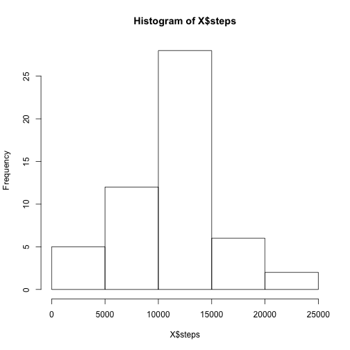
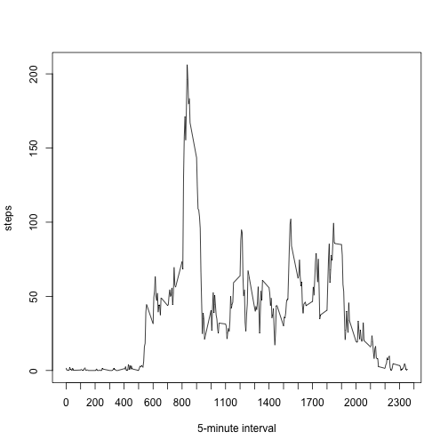
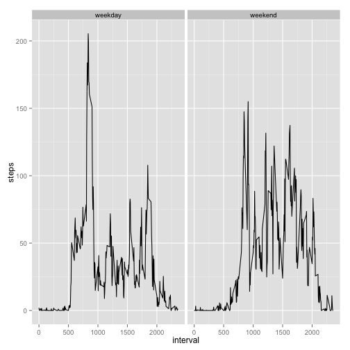

#Title: Coursera Course Reproducible Research, Peer Assessment 1  

================================================================  
**Jikke Romijn, Date: 12 november 2015**   


For this project the dataset called Activity.csv is used. This dataset can be found in the same Github repository where you found this R Markdown document. The dataset contains 17,568 observations of 3 variables. The variables in the activity.csv dataset are:  
* Steps: the number of steps that were recorded in the interval specified  
* Date: the date when the steps were recorded, in YYYY-MM-DD format  
* Interval: a numeric identifier of the interval for which the steps were recorded  

In this R Markdown document, the R code can be found which was used to answer the questions asked in the peer assessment.  

**I started with reading the csv-file from the folder that contains the cloned GitHub repository of Roger Peng:**  


```r
dataset<-read.csv("~/Coursera/RepData_PeerAssessment1/activity.csv", header=TRUE)
```

**And I added a date variable of class "date" by calling as.POSIXct:**  


```r
dataset$date2<-as.POSIXct(strptime(dataset$date, format="%Y-%m-%d"))
```

**As off here, I started answering the Peer Assesment 1 questions:**  

###1. What is mean total number of steps taken per day?  
For this part of the assignment, you can ignore the missing values in the dataset.  
Calculate the total number of steps taken per day:  


```r
with(dataset, aggregate(steps ~ date2, data=dataset, sum))
```

```
##         date2 steps
## 1  2012-10-02   126
## 2  2012-10-03 11352
## 3  2012-10-04 12116
## 4  2012-10-05 13294
## 5  2012-10-06 15420
## 6  2012-10-07 11015
## 7  2012-10-09 12811
## 8  2012-10-10  9900
## 9  2012-10-11 10304
## 10 2012-10-12 17382
## 11 2012-10-13 12426
## 12 2012-10-14 15098
## 13 2012-10-15 10139
## 14 2012-10-16 15084
## 15 2012-10-17 13452
## 16 2012-10-18 10056
## 17 2012-10-19 11829
## 18 2012-10-20 10395
## 19 2012-10-21  8821
## 20 2012-10-22 13460
## 21 2012-10-23  8918
## 22 2012-10-24  8355
## 23 2012-10-25  2492
## 24 2012-10-26  6778
## 25 2012-10-27 10119
## 26 2012-10-28 11458
## 27 2012-10-29  5018
## 28 2012-10-30  9819
## 29 2012-10-31 15414
## 30 2012-11-02 10600
## 31 2012-11-03 10571
## 32 2012-11-05 10439
## 33 2012-11-06  8334
## 34 2012-11-07 12883
## 35 2012-11-08  3219
## 36 2012-11-11 12608
## 37 2012-11-12 10765
## 38 2012-11-13  7336
## 39 2012-11-15    41
## 40 2012-11-16  5441
## 41 2012-11-17 14339
## 42 2012-11-18 15110
## 43 2012-11-19  8841
## 44 2012-11-20  4472
## 45 2012-11-21 12787
## 46 2012-11-22 20427
## 47 2012-11-23 21194
## 48 2012-11-24 14478
## 49 2012-11-25 11834
## 50 2012-11-26 11162
## 51 2012-11-27 13646
## 52 2012-11-28 10183
## 53 2012-11-29  7047
```

If you do not understand the difference between a histogram and a barplot, research the difference between them. Make a histogram of the total number of steps taken each day:


```r
X<-with(dataset, aggregate(steps ~ date2, data=dataset, sum))
hist(X$steps)
```

 

Calculate and report the mean and median of the total number of steps taken per day:


```r
mean(X$steps)
```

```
## [1] 10766.19
```

```r
median(X$steps)
```

```
## [1] 10765
```

###2. What is the average daily activity pattern?
Make a time series plot (i.e. type = "l") of the 5-minute interval (x-axis) and the average number of steps taken, averaged across all days (y-axis)  

```r
Y<-with(dataset, aggregate(steps ~ interval, data=dataset, mean))
with(Y, plot(Y$interval, Y$steps, type="line", xlab="5-minute interval", ylab="steps", xaxp=c(0,2400,24)))
```

```
## Warning in plot.xy(xy, type, ...): plot type 'line' will be truncated to
## first character
```

 

Which 5-minute interval, on average across all the days in the dataset, contains the maximum number of steps?  

```r
library(dplyr)
```

```
## 
## Attaching package: 'dplyr'
## 
## The following objects are masked from 'package:data.table':
## 
##     between, last
## 
## The following objects are masked from 'package:stats':
## 
##     filter, lag
## 
## The following objects are masked from 'package:base':
## 
##     intersect, setdiff, setequal, union
```

```r
maximum<-arrange(Y, desc(steps))
head(maximum, n=1L)
```

```
##   interval    steps
## 1      835 206.1698
```

###3. Imputing missing values
Note that there are a number of days/intervals where there are missing values (coded as NA). The presence of missing days may introduce bias into some calculations or summaries of the data.  

Calculate and report the total number of missing values in the dataset (i.e. the total number of rows with NAs):  
**The total number of missing values in the steps-variable is:**    

```r
sum(is.na(dataset$steps))
```

```
## [1] 2304
```

**Both other variables contain no missing values:**  

```r
sum(is.na(dataset$date))
```

```
## [1] 0
```

```r
sum(is.na(dataset$interval))
```

```
## [1] 0
```

Devise a strategy for filling in all of the missing values in the dataset. The strategy does not need to be sophisticated. For example, you could use the mean/median for that day, or the mean for that 5-minute interval, etc. Create a new dataset that is equal to the original dataset but with the missing data filled in.  

**I have chosen to calculate the median for each 5-minute interval averaged across all days in the dataset, and attribute that value to each missing value in that same 5-minute interval. I saved the dataset thus created as "DT":**  


```r
library(data.table)
DT <- data.table(dataset)
setkey(DT, interval)
DT[, steps:= ifelse(is.na(steps), median(steps, na.rm=TRUE), steps), by=interval]
```

Make a histogram of the total number of steps taken each day and Calculate and report the mean and median total number of steps taken per day. Do these values differ from the estimates from the first part of the assignment? What is the impact of imputing missing data on the estimates of the total daily number of steps?  

**The new histogram differs from the old one in one aspect: the frequency of total number of steps in the 1st quintile has increased quite a bit. In the other 4 quintiles, nothing has changed. It appears that missing values occurred only in time intervals where there was low activity altogether.**  

```r
Z<-with(DT, aggregate(steps ~ date2, data=DT, sum))
hist(Z$steps)
```

 

**Logically, the mean and median values are lower in the new dataset accordingly.**  
**For easy comparison, I produce the 'old' mean and median values first:**  

```r
mean(X$steps)
```

```
## [1] 10766.19
```

```r
median(X$steps)
```

```
## [1] 10765
```

**And these are the 'new' mean and median values:**  

```r
mean(Z$steps)
```

```
## [1] 9503.869
```

```r
median(Z$steps)
```

```
## [1] 10395
```

###4. Are there differences in activity patterns between weekdays and weekends?
For this part the weekdays() function may be of some help here. Use the dataset with the filled-in missing values for this part.

**The code for doing this is:**  

```r
DT$weekdays<-weekdays(DT$date2, abbreviate=FALSE)
```

**Create a new factor variable in the dataset with two levels – “weekday” and “weekend” indicating whether a given date is a**  
**weekday or weekend day. Please note that 'zaterdag' and ' zondag' are Saturday and Sunday in Dutch.**  


```r
  weekend <- c('zaterdag', 'zondag')
  DT$weekorweekend <- factor((DT$weekdays %in% weekend), 
         levels=c(FALSE, TRUE), labels=c('weekday', 'weekend')) 
```

Make a panel plot containing a time series plot (i.e. type = "l") of the 5-minute interval (x-axis) and the average number of steps taken, averaged across all weekday days or weekend days (y-axis). See the README file in the GitHub repository to see an example of what this plot should look like using simulated data.  

**Following panel plot shows the average number of steps per interval on weekdays versus weekenddays.**  

```r
library(ggplot2)
  DT2<-with(DT, aggregate(steps ~ interval+weekorweekend, data=DT, mean))
  g<-ggplot(DT2, aes(interval, steps))
  g+ geom_line() + facet_grid(.~ weekorweekend)
```

 

